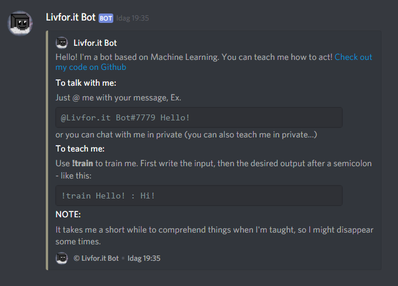

### Livfor.it Bot, Machine Learning Bot

Build on Node with Discord.js and Brain.js

The bot learns from listening to text conversations.
You can talk to the via DM, @Mentions or using the command !talk.

To teach the bot specific things, use !train Input : Output

The brain is stored in network.json, saved after each training.

